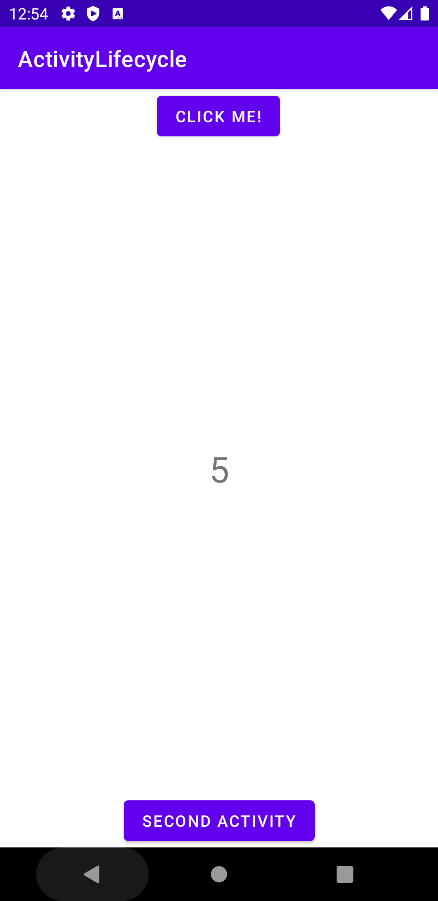
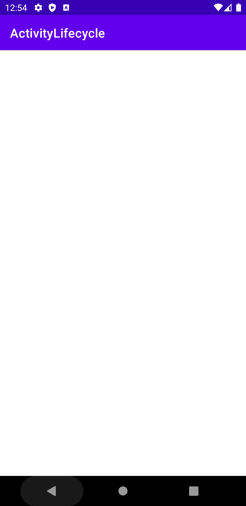
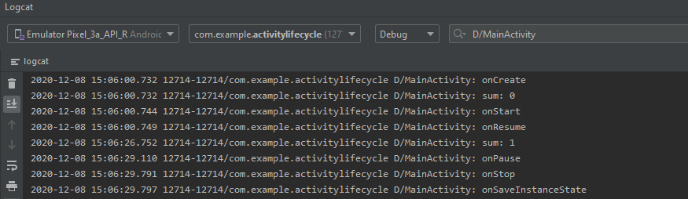

# Activity Lifecycle
An android app that showcases the android activity lifecycle. There are two activities, MainActivity.java and Activity2.java. Using the logcat and the log class, this app shows the user when each callback is called in both activities. Both activities have a button that is used to switch between the two and showcase how the lifecycles interact in each respective activity and when switching between the two.
# First User Interfact Activity
    
# Second User Interfact Activity
After Clicked Second Activity

# View
The android activity lifecycle includes the following callbacks: onCreate(), onStart(), onResume(), onPause(), onStop(), onRestart(), and onDestroy(). These callbacks offer areas for developers to dictate how apps behave.

# onCreate()
This activity is mandatory. It must be in all activities in an android project. the activity lifecycle begins here. This is where any layout resources (buttons, textViews, etc.) and background threads are initialized.

# onStart()
Called right after onCreate(). An activity is in this state when it becomes visible to the user.

# onResume()
Called when the user returns to an activity after briefly exiting it. At this point, the user is interacting with the activity and is completely visible to the user.

# onPause()
Called when the user leaves the current activity to another activity or leaves the app altogether. Certain processes that are not needed while the activity is not in the foreground will be stopped.

# onStop()
Called when the activiy becomes invisible to the user. The activity and its resources may still be running in the background even though it is not visible.

# onRestart()
Called after an activity has been stopped. This call reverts the activity to its visible lifetime.

# onDestroy()
The end of the activity lifecycle. This activity is used to stop all resources and tasks started in onCreate().

# How to use this:

As stated earlier, there are two activities in this app. Toasts on the screen and logs in the logcat show up whenever a callback is called.

You can view the logcat logs by opening the logcat in android studio while your android device is running the app and connected to your computer.

When looking at the actual phone screen, you can see that the toasts for each respective OnCreate will pop up on the screen then it start to do activitis.
